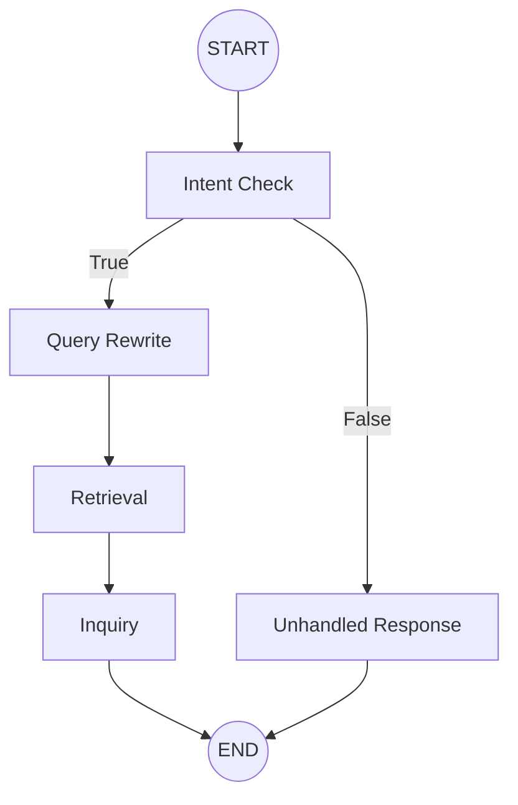

## Context

The \`GraphProcessor\` is the core LLM orchestration engine in \`muggle\`. It currently uses a LangGraph workflow but lacks RAG (Retrieval-Augmented Generation) capabilities. A Milvus-based vector store and an FAQ ingestion pipeline are already in place, but they are not yet integrated into the main query path.

## Goals / Non-Goals

**Goals:**
- Integrate \`VectorStoreManager\` into \`GraphProcessor\`.
- Implement a multi-node RAG pipeline (Rewrite -> Retrieve -> Inquire).
- Augment the LLM prompt with retrieved FAQ context.
- Maintain existing conversational memory.

**Non-Goals:**
- Modifying the \`intent_check_node\`.
- Changing the FAQ ingestion pipeline (\`FAQLoader\`).
- Implementing multi-hop retrieval or advanced RAG techniques (e.g., re-ranking).

## Detailed RAG Workflow

### 1. Data Ingestion (Offline/Pre-processing)
This phase prepares the knowledge base for retrieval. It is currently handled by \`FAQLoader\`.

1. **Load Source**: Read the FAQ markdown file (\`aia_faq.md\`).
2. **Split by Header**: Use \`MarkdownHeaderTextSplitter\` to break the document into sections based on \`###\` headers (the questions).
3. **Recursive Chunking**: For long sections (>200 characters), use \`RecursiveCharacterTextSplitter\` to create smaller segments (~300 characters) to ensure high-granularity retrieval.
4. **Embedding**: Convert both the headers and the full text/segments into 1024-dimensional vectors using \`DashScopeEmbeddings\`.
5. **Store in Milvus**: Upsert the records into the \`muggle_faq\` collection. Each record contains:
    - \`id\`: Deterministic hash of the text.
    - \`header_vector\`: Embedding of the question.
    - \`content_vector\`: Embedding of the full section/segment.
    - \`text\`: The raw markdown content.
    - \`is_segment\`: Boolean flag indicating if it's a sub-chunk.

### 2. Multi-Node Retrieval Pipeline (Online)

The workflow is expanded into dedicated nodes to separate reasoning from retrieval:

1. **Query Rewrite Node**:
    - **Input**: \`messages\` (history).
    - **System Prompt**: \`prompt-query-rewrite.md\`.
    - **Logic**: Converts conversational references (e.g., \"Tell me more about that\") into a standalone search query.
    - **Output**: \`vector_store_query\` field in state.
2. **Retrieval Node**:
    - **Input**: \`vector_store_query\`.
    - **Logic**: Performs Milvus search using the rewritten query.
    - **Output**: \`context\` field (List[Dict]) in state.
3. **Inquiry Node**:
    - **Input**: \`messages\` + \`context\`.
    - **Logic**: Augments prompt with context and generates response.
    - **Output**: \`response\` field.

### 3. Updated Graph Visualization

## Decisions

- **State Separation**: Use dedicated fields (\`vector_store_query\`, \`context\`) instead of modifying \`messages\`.
  - *Rationale*: Keeps conversation history clean and makes it easier for subsequent nodes to access specific RAG data.
- **Dedicated Rewrite Node**:
  - *Rationale*: Decoupling query optimization from response generation allows for better tuning of the retrieval accuracy.
- **Dedicated Retrieval Node**:
  - *Rationale*: Pure Python/IO node that doesn't require an LLM call, reducing costs and latency for that specific step.
- **Dependency Injection**: Pass \`VectorStoreManager\` to \`GraphProcessor.__init__\`. 
  - *Rationale*: Cleanest way to provide the required infrastructure component.
- **Top-K Retrieval**: Make $k$ configurable via \`config.toml\` (defaulting to 3).
  - *Rationale*: Allows easy tuning of retrieval depth without code changes, balancing context richness vs. token cost.
- **Prompt Templating**: Use **Jinja2** (via \`PromptRegistry.get_system_prompt\`) to inject context into the \`prompt-inquiry\` system prompt.
  - *Rationale*: \`PromptRegistry\` is already configured with Jinja2, allowing for clean template separation and conditional logic.
  - *Implementation*: Add a \`{{ context }}\` placeholder in \`prompt-inquiry.md\`.
- **Vector Field**: Use \`content_vector\` for searching.
  - *Rationale*: \`content_vector\` covers both header and body, providing better semantic match for user questions.

## Implementation Standards

To maintain consistency with the existing \`GraphProcessor\` codebase, the following standards MUST be followed:

### 1. Node Definition
- **Location**: Define all nodes as inner functions within \`GraphProcessor.__init__\`.
- **Signature**: \`def node_name(state: WorkflowState) -> dict:\`.
- **Return Type**: Always return a dictionary containing only the keys to be updated in the state.

### 2. LLM Node Pattern (Rewrite & Inquiry)
- Use the project's \`create_agent\` wrapper (imported from \`langchain.agents\`).
- **Pattern**:
  \`\`\`python
  state = create_agent(
      model=self.registry.get_model(self.default_model),
      system_prompt=self.prompt_registry.get_system_prompt(CONSTANT, variables=vars),
      response_format=ResultModel
  ).invoke(state)
  return {
      \"field_name\": pydash.get(state, \"structured_response.field_name\"),
      \"messages\": pydash.get(state, \"messages\")
  }
  \`\`\`

### 3. Logic Node Pattern (Retrieval)
- Perform operations directly on \`state\` or \`self.vector_store\`.
- **Standard**: Avoid LLM calls for the \`retrieval\` node to minimize latency.

### 4. Constant Usage
- All node names and prompt names MUST use constants defined in \`src/muggle/shared/constants.py\`.
  - Node: \`STR_NODE_QUERY_REWRITE\`, \`STR_NODE_RETRIEVAL\`
  - Prompt: \`STR_PROMPT_QUERY_REWRITE\`

## Risks / Trade-offs

- **[Risk] Milvus Latency** → Mitigation: Handle exceptions gracefully. Milvus is generally fast enough.
- **[Risk] Context Overflow** → Mitigation: Monitor token usage. FAQ segments are small (~300 chars).
- **[Risk] Irrelevant Context** → Mitigation: Instruct the LLM to only use the context if relevant (updated \`prompt-inquiry\`).
